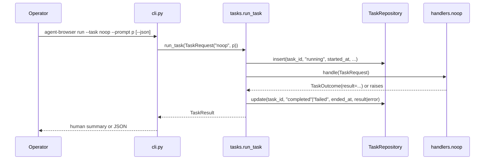

# Design Document

## Metadata

- **Spec**: `001-prd-runtime-foundation`
- **Status**: `approved`
- **Requirements source**: `requirements.md`

## Overview

This design implements the walking-skeleton runtime for `agent-browser`. It introduces a Python package with two operator-facing entrypoints (`python -m agent_browser` and `agent-browser`), a CLI `run` command that dispatches a registered task handler, a single `noop` handler, a minimal SQLite `tasks` table for persistence, and stable human/JSON output formats. No browser, CDP, LLM, or approval logic is introduced.

The design favors stdlib-only dependencies, a `src/`-layout package, an explicit handler registry, and a thin orchestrator that owns task lifecycle persistence. This keeps the foundation small enough to validate end-to-end without Windows browser availability, while leaving deliberate seams for `002-prd-cdp-browser-connection`, `003-prd-approval-gates`, and `004-prd-browser-agent-adapter` to plug into later.

## Steering Document Alignment

### Technical Standards

- `steering/tech.md`: Python-only MVP, `pytest` as the canonical gate, local SQLite persistence, `.env`-style config not committed. This design uses Python stdlib (`argparse`, `sqlite3`, `pathlib`, `uuid`, `datetime`) and adds only `pytest` as a dev dependency.
- `steering/tech.md` security posture: no CDP, browser profile, or provider secret reads; this design keeps to that constraint by introducing only the database path environment variable.

### Project Structure

`steering/structure.md` lists `cli.py`, `tasks.py`, `storage/db.py`, and `storage/repositories.py` as canonical modules. This spec implements those modules and defers `approvals.py`, `browser/`, `agents/`, and `workflows/` to later specs. The dual entrypoint decision (`python -m agent_browser` plus `agent-browser` console script) was added to `steering/structure.md` during requirements work and is preserved.

## Code Reuse Analysis

Repository contains no source code yet. There is nothing to reuse internally.

| Existing asset                      | Reuse strategy                                                               |
| ----------------------------------- | ---------------------------------------------------------------------------- |
| `steering/structure.md` boundaries  | Use as pattern reference for module placement (`cli`, `tasks`, `storage/`)   |
| `.codex/testing.md` minimum gate    | Use exact `pytest -q` command in tasks/validation                            |
| Python `argparse` (stdlib)          | Call directly for CLI parsing; avoids adding `click`/`typer` dependency      |
| Python `sqlite3` (stdlib)           | Call directly through a thin connection helper; avoids adding ORM dependency |
| Python `uuid.uuid4()` (stdlib)      | Use as task id source                                                        |
| Python `datetime.now(timezone.utc)` | Use as timestamp source; ISO 8601 strings stored as TEXT                     |

No external library grounding (`ctx7`) is needed: `argparse`, `sqlite3`, `pathlib`, `uuid`, `datetime`, and `pytest` are all standard, well-exercised tools.

## Selected Approach

- **Chosen option**: Stdlib-only walking skeleton with explicit handler registry.
- **Why this option**: Smallest footprint that satisfies all six requirements. Avoids commitment to a CLI framework, ORM, or DI container before real workflows justify them. Every module has a single, named role and is independently testable. The `noop` handler proves the runtime path without coupling to browser, agent, or approval concerns.
- **Rejected alternatives**:
  - **`click`/`typer` for CLI**: rejected — adds a runtime dependency for a 3-flag command surface.
  - **SQLAlchemy or `aiosqlite`**: rejected — schema is one table; stdlib `sqlite3` is sufficient and synchronous fits an interactive CLI.
  - **Plugin entry points (`importlib.metadata.entry_points`) for handlers**: rejected — premature; a single in-process registry is enough for foundation, and entry points can be layered on later without API change.
  - **Async runtime from day one**: rejected — no I/O parallelism is needed in this spec; future browser specs can introduce async at their own boundaries.

## Architecture

The runtime is a thin synchronous pipeline. The CLI parses arguments and delegates to a task orchestrator. The orchestrator resolves the handler, persists task lifecycle transitions through a repository, runs the handler, captures the result or error, and returns a structured `TaskResult`. The CLI then formats output for stdout.

```mermaid
flowchart TD
    Op[Operator / Pi] -->|agent-browser run --task noop --prompt "..."| CLI[cli.py]
    CLI -->|TaskRequest| Orch[tasks.run_task]
    Orch -->|lookup| Reg[HANDLERS registry]
    Orch -->|insert running| Repo[storage.repositories.TaskRepository]
    Orch -->|invoke| Noop[handlers.noop]
    Noop -->|TaskResult| Orch
    Orch -->|update completed/failed| Repo
    Repo -->|sqlite3| DB[(SQLite tasks table)]
    Orch -->|TaskResult| CLI
    CLI -->|human or JSON| Stdout[stdout]
```



## Components and Interfaces

## Files and Modules Affected

- **Create**: `pyproject.toml`
- **Create**: `src/agent_browser/__init__.py`
- **Create**: `src/agent_browser/__main__.py`
- **Create**: `src/agent_browser/cli.py`
- **Create**: `src/agent_browser/config.py`
- **Create**: `src/agent_browser/tasks.py`
- **Create**: `src/agent_browser/handlers.py`
- **Create**: `src/agent_browser/storage/__init__.py`
- **Create**: `src/agent_browser/storage/db.py`
- **Create**: `src/agent_browser/storage/repositories.py`
- **Create**: `tests/__init__.py`
- **Create**: `tests/conftest.py`
- **Create**: `tests/unit/test_cli.py`
- **Create**: `tests/unit/test_config.py`
- **Create**: `tests/unit/test_tasks.py`
- **Create**: `tests/unit/test_storage.py`
- **Modify**: `.gitignore` — add `*.sqlite3`/data dirs (already present from bootstrap; verify and extend if needed).
- **No change**: `steering/`, `.codex/testing.md` content (entrypoint addition already captured in `structure.md`).

### `pyproject.toml`

- **Purpose:** Declare package, console-script entrypoint, and dev dependencies.
- **Interfaces:** Build backend `hatchling` with `[tool.hatch.build.targets.wheel]` `packages = ["src/agent_browser"]`. `[project.scripts] agent-browser = "agent_browser.cli:main"`. `[project.optional-dependencies] dev = ["pytest"]`. Python `>=3.10`.
- **Dependencies:** `hatchling` (build only), `pytest` (dev only). No runtime third-party deps.

### `src/agent_browser/__init__.py`

- **Purpose:** Package marker; expose `__version__`. Bootstraps the default handler registry.
- **Interfaces:** `__version__: str`. At the bottom of the file, co-imports `tasks` and `handlers` and calls `handlers.register_default_handlers(tasks.HANDLERS)`. This is the one place where both modules are co-imported, so neither needs to import the other at module top level.
- **Dependencies:** `tasks`, `handlers` (imported at the bottom of the file to keep the bootstrap explicit and to avoid evaluation during interpreter shutdown).

### `src/agent_browser/__main__.py`

- **Purpose:** Enable `python -m agent_browser`.
- **Interfaces:** Calls `cli.main()` and exits with its return code.
- **Dependencies:** `cli`.

### `src/agent_browser/cli.py`

- **Purpose:** Parse arguments, dispatch to orchestrator, format output.
- **Interfaces:**
  - `def main(argv: list[str] | None = None) -> int`
  - Subcommand `run` with `--task` (required), `--prompt` (required), `--json` (flag).
  - `argparse.ArgumentParser(prog="agent-browser", ...)` is used explicitly so both `agent-browser` and `python -m agent_browser` show the same help banner (R-01 AC3).
  - On unknown task: exits non-zero (code `4`) and reports the bad task name plus the list of registered task names. No `tasks` row is written — see Error Handling Scenario 1 for the explicit interpretation of R-02 AC4 ("when possible").
  - **Orchestration sequence inside `main`**:
    1. Parse args via `argparse` (usage error → exit 2, argparse default).
    2. `path = resolve_db_path(os.environ); ensure_db_parent(path)`.
    3. `with closing(open_db(path)) as conn:` build `TaskRepository(conn)`.
    4. `result = run_task(TaskRequest(task_name, prompt), repo=repo)`. `run_task` owns the transactional boundary (see `tasks.py` and "Persistence and transactions" below).
    5. Format human or JSON to stdout; return exit code per the table below.
  - **`SystemExit` handling:** `argparse` raises `SystemExit` for `--help` and usage errors. `cli.main` lets it propagate; tests catch it via the `cli_runner` fixture (see `tests/conftest.py`).
  - **Exit code table**:
    - `0` — task completed.
    - `1` — task ran but handler raised; `tasks` row is `failed`.
    - `2` — argparse usage error (default).
    - `3` — DB path/open error (`OSError` from parent directory creation, `sqlite3.Error` from SQLite open/schema initialization, and `ValueError` from `resolve_db_path` for non-empty relative `AGENT_BROWSER_DB_PATH`). `ensure_db_parent` re-raises `OSError` directly (no wrapping); CLI catches `OSError`, `sqlite3.Error`, and `ValueError` for this exit path.
    - `4` — `UnknownTaskError`.
  - **Stdout/stderr contract:** On the success path and on handler-failure path with `--json`, stdout contains exactly one JSON object and nothing else; stderr is empty or contains a short human note. On argparse usage errors and DB-open errors, stdout is empty and stderr carries the human error — there is no `TaskResult` to serialize at that point. Pi/script consumers should parse stdout opportunistically: try `json.loads`, fall through to stderr.
- **Dependencies:** `argparse`, `tasks.run_task`, `tasks.TaskRequest`, internal formatter helpers.

### `src/agent_browser/config.py`

- **Purpose:** Resolve database path from `AGENT_BROWSER_DB_PATH` or default `~/.local/share/agent-browser/agent-browser.sqlite3`. Ensure parent directory exists when caller chooses to materialize.
- **Interfaces:**
  - `DEFAULT_DB_PATH: Path` (computed lazily via function, not import-time, to keep tests pure).
  - `def resolve_db_path(env: Mapping[str, str] | None = None) -> Path` — pure function; reads `os.environ` by default.
    - The default branch returns `Path.home() / ".local" / "share" / "agent-browser" / "agent-browser.sqlite3"`. Tests substitute `Path.home` via `monkeypatch.setattr(Path, "home", ...)`; do not use `os.path.expanduser` so this substitution works.
    - Empty-string env value (`AGENT_BROWSER_DB_PATH=""`) is treated as **unset** (falls through to default). Avoids the silent `Path("")` → cwd footgun.
    - Non-absolute env values are rejected with `ValueError("AGENT_BROWSER_DB_PATH must be an absolute path; got '<value>'")`. The CLI maps this to exit 3.
  - `def ensure_db_parent(path: Path) -> None` — creates parent directories with `mkdir(parents=True, exist_ok=True)`. On `OSError`, re-raises the original `OSError` (or `raise OSError(msg) from e`) so `cli.main`'s single `OSError` catch handles it. Does **not** wrap in `RuntimeError`.
- **Dependencies:** `os`, `pathlib`.

### `src/agent_browser/tasks.py`

- **Purpose:** Define task types, the handler registry, and the orchestration function. Owns lifecycle transitions and time/UUID generation.
- **Interfaces:**
  - `@dataclass(frozen=True) class TaskRequest: task_name: str; prompt: str`
  - `@dataclass(frozen=True) class TaskOutcome: result: str` — what handlers return.
  - `@dataclass(frozen=True) class TaskResult: task_id: str; task_name: str; prompt: str; status: Literal["completed", "failed"]; started_at: str; ended_at: str; result: str | None; error: str | None`
    - `started_at` / `ended_at` are `datetime.isoformat()` of timezone-aware UTC `datetime` objects (always carry `+00:00`). The same string is stored in SQLite and emitted in JSON.
    - `error`, when set, is `f"{type(exc).__name__}: {exc}"` truncated to 1024 characters. Tracebacks are **not** persisted.
  - `class UnknownTaskError(Exception)` — raised when handler not registered.
  - `Handler = Callable[[TaskRequest], TaskOutcome]`
  - `Clock = Callable[[], datetime]`
  - `def utc_now() -> datetime: return datetime.now(timezone.utc)`
  - `HANDLERS: dict[str, Handler]` — populated at import time via `handlers.register_default_handlers(HANDLERS)`.
  - `def register_handler(name: str, fn: Handler) -> None` and `def unregister_handler(name: str) -> None` — small test seam so fixtures install/restore fakes without poking the global dict directly.
  - `def run_task(request: TaskRequest, *, repo: TaskRepository, clock: Clock = utc_now, id_factory: Callable[[], str] = lambda: uuid4().hex) -> TaskResult`
- **Persistence and transactions:** `run_task` wraps the entire lifecycle (`insert_running` → handler invocation → `mark_completed`/`mark_failed`) in a single SQLite transaction via `with repo.conn:` (the connection's context manager auto-commits on success and rolls back on any exception escaping the block). Handler exceptions are caught **inside** the transaction so the `running → failed` update is committed atomically. Consequence: a kill (`SIGKILL`/`SIGINT`) between `insert_running` and the terminal update **rolls back** the inserted row — no stale `running` row is left behind.
- **Bootstrap:** `tasks.py` does **not** import `handlers`. `HANDLERS` starts empty; `agent_browser/__init__.py` co-imports `tasks` and `handlers` and calls `handlers.register_default_handlers(HANDLERS)`. This breaks the `tasks ↔ handlers` cycle.
- **Dependencies:** `uuid`, `datetime`, `dataclasses`, `storage.repositories.TaskRepository`. Does **not** import `handlers`.

### `src/agent_browser/handlers.py`

- **Purpose:** Provide the `noop` handler and a hook to register defaults.
- **Interfaces:**
  - `def noop(request: TaskRequest) -> TaskOutcome` — returns `TaskOutcome(result=f"noop completed: {request.prompt}")`. No I/O, no network, no logging beyond stdlib.
  - `def register_default_handlers(registry: dict[str, Handler]) -> None` — sets `registry["noop"] = noop`.
- **Handler discipline:** Handlers must **not** write to stdout. Diagnostics go to stderr or are returned in `TaskOutcome.result`. The `--json` stdout contract depends on this. Future browser/agent handlers (004+) will need to suppress or redirect third-party stdout (browser-use, Playwright) to honour this rule.
- **Dependencies:** `tasks` (types only).

### `src/agent_browser/storage/db.py`

- **Purpose:** Open SQLite connections and apply schema.
- **Interfaces:**
  - `SCHEMA_SQL: str` — `CREATE TABLE IF NOT EXISTS tasks (...)`.
  - `def connect(path: Path) -> sqlite3.Connection` — opens with default settings, sets `row_factory = sqlite3.Row`, and runs `SCHEMA_SQL` on every connect (idempotent via `IF NOT EXISTS`). `detect_types` and `PRAGMA foreign_keys` are intentionally left at their defaults; both are unnecessary for the foundation schema (all columns are TEXT, no FKs) and can be added by a later spec when justified.
  - `def open_db(path: Path) -> sqlite3.Connection` — wraps `ensure_db_parent` + `connect`.
- **Dependencies:** `sqlite3`, `pathlib`, `config.ensure_db_parent`.

### `src/agent_browser/storage/repositories.py`

- **Purpose:** Encapsulate SQL for the `tasks` table behind a small repository.
- **Interfaces:**
  - `class TaskRepository:`
    - `def __init__(self, conn: sqlite3.Connection)`
    - `conn: sqlite3.Connection` is exposed (read-only by convention) so `run_task` can use it as a context manager for the transaction boundary.
    - `def insert_running(self, task_id: str, task_name: str, prompt: str, started_at: str) -> None`
    - `def mark_completed(self, task_id: str, ended_at: str, result: str) -> None`
    - `def mark_failed(self, task_id: str, ended_at: str, error: str) -> None`
    - `def get(self, task_id: str) -> sqlite3.Row | None` — used by tests.
- **Commit semantics:** Repository methods do **not** call `commit()`. The orchestrator (`run_task`) owns the transaction boundary via `with repo.conn:`. A repo method called outside that context will not persist until the caller commits — intentional and tested.
- **Dependencies:** `sqlite3`.

### `tests/conftest.py`

- **Purpose:** Provide isolated SQLite path per test and a CLI-runner helper.
- **Interfaces:**
  - `tmp_db_path` fixture (function-scoped) — sets `AGENT_BROWSER_DB_PATH` to a `tmp_path / "agent-browser.sqlite3"` via `monkeypatch.setenv`.
  - `cli_runner` fixture — invokes `cli.main(argv)`, catches `SystemExit` (raised by argparse for `--help` and usage errors), and returns `(exit_code, stdout, stderr)` where `exit_code` is `e.code` for `SystemExit` or the int returned by `cli.main(...)` otherwise.
  - `handlers_snapshot` fixture (autouse, function-scoped) — snapshots `tasks.HANDLERS` before each test and restores it after, so tests that register fake handlers cannot leak into other tests.
- **Dependencies:** `pytest`, `agent_browser.cli`.

## Data Models

### `tasks` (SQLite table)

```sql
CREATE TABLE IF NOT EXISTS tasks (
    id          TEXT PRIMARY KEY,
    task_name   TEXT NOT NULL,
    prompt      TEXT NOT NULL,
    status      TEXT NOT NULL CHECK (status IN ('running', 'completed', 'failed')),
    started_at  TEXT NOT NULL,
    ended_at    TEXT,
    result      TEXT,
    error       TEXT
);
```

**Schema evolution note:** SQLite's `ALTER TABLE` cannot modify a `CHECK` constraint. Adding a new `status` value (e.g., `awaiting_approval` for 003, `pending`/`cancelled` for 006) requires the SQLite 12-step table-rebuild procedure (create new table with updated CHECK, copy rows, drop old, rename). This is intentional: catching invalid states early is worth one rebuild per state-machine extension. The `Compatibility and Rollout` section's claim of "simple ALTER/CREATE" applies to additive columns and new tables, not to evolving the CHECK constraint.

### JSON output schema (R-06 AC2)

`--json` prints exactly one JSON object with these keys, in this order, on the success and handler-failure paths:

```json
{
  "task_id": "<uuid4 hex string>",
  "task_name": "noop",
  "prompt": "<operator-supplied string>",
  "status": "completed | failed",
  "started_at": "2026-05-14T12:34:56.789012+00:00",
  "ended_at": "2026-05-14T12:34:56.890123+00:00",
  "result": "<string or null>",
  "error": "<string or null>"
}
```

Future fields are additive only; existing keys and types are stable across `001`–`005`.

- `task_id`: UUID4 hex string (`uuid.uuid4().hex`).
- `task_name`: canonical handler key, e.g. `"noop"`.
- `prompt`: operator-supplied string. Persisted as-is for the foundation spec only; future sensitive workflows must redact.
- `status`: state machine: `running → completed | failed`. Terminal states are not re-entered.
- `started_at` / `ended_at`: ISO 8601 UTC strings (e.g. `2026-05-14T12:34:56.789012+00:00`).
- `result`: free-text handler outcome on completion; `NULL` on failure.
- `error`: short failure message on failure; `NULL` on completion.

### In-memory dataclasses

- `TaskRequest(task_name, prompt)` — immutable input.
- `TaskOutcome(result)` — handler return.
- `TaskResult(task_id, task_name, prompt, status, started_at, ended_at, result, error)` — orchestrator return; serialized to JSON for `--json`.

## Error Handling

## Compatibility and Rollout

- **Backward compatibility**: First release; no compatibility surface to preserve. The `tasks` schema and CLI argument names are the first public commitments and should remain stable for `002`–`005`.
- **Migration or sequencing**: None — schema is created idempotently with `CREATE TABLE IF NOT EXISTS`. Future schema changes (events table, approvals) belong to their own specs and may use simple ALTER/CREATE statements at that time; no migration framework is introduced now.
- **Feature flag / rollout plan**: Not applicable; local single-operator tool.
- **Rollback plan**: Reverting the spec branch removes the package entirely; the local SQLite file at `~/.local/share/agent-browser/agent-browser.sqlite3` is operator-owned and harmless if abandoned (and trivial to delete).

### Error Scenarios

1. **Unknown task name:**
   - **Handling:** `run_task` raises `UnknownTaskError` before persisting any row. The CLI catches it, prints `Error: unknown task '<name>'. Known: <comma-separated handler names>` to stderr, and exits with code `4`. No `tasks` row is written.
   - **R-02 AC4 interpretation:** AC4 says "record the task failure **when possible**." This design treats an unknown task name as input validation that fires before the task lifecycle begins, so "recording" is interpreted as not possible/not appropriate — the alternative would be a `running→failed` row whose only signal is "operator typo," which pollutes the `tasks` log that downstream queue/observability specs will read. If a future spec wants typo telemetry, it should be added via a separate channel, not the `tasks` table.
   - **User Impact:** `Error: unknown task 'foo'. Known: noop` on stderr; exit code `4`; `tasks` table untouched.

2. **Handler raises exception:**
   - **Handling:** `run_task` catches `Exception`, computes `ended_at`, calls `repo.mark_failed(task_id, ended_at, summary)` where `summary = f"{type(exc).__name__}: {exc}"[:1024]`, and returns a `TaskResult` with `status="failed"`. CLI prints the failure summary (human or JSON to stdout) and exits with code `1`. Tracebacks are not persisted and are not surfaced to stdout in either mode; stderr may include a short `Error: ...` line in human mode.
   - **User Impact:** Persisted `failed` row; exit code `1`; visible error summary.

3. **Missing required CLI argument:**
   - **Handling:** `argparse` emits a usage error and exits with code `2` before any DB work.
   - **User Impact:** Standard argparse error message on stderr; non-zero exit; no DB touched.

4. **Database path not writable:**
   - **Handling:** `ensure_db_parent` re-raises the underlying `OSError`; `sqlite3.connect` raises `sqlite3.OperationalError` (caught by `cli.main` alongside `OSError`). CLI prints `Error: cannot open database at <path>: <reason>` to stderr, exits with code `3`. No partial row is written because the connection never opens. A non-empty relative `AGENT_BROWSER_DB_PATH` triggers `ValueError` from `resolve_db_path`, which the CLI also maps to exit `3` with a path-bearing error. Empty `AGENT_BROWSER_DB_PATH` is treated as unset and falls back to the default path.
   - **User Impact:** Clear, path-bearing error; non-zero exit; nothing written.

5. **Process killed mid-task:**
   - **Handling:** Because `run_task` wraps the entire lifecycle in a single `with repo.conn:` transaction, a `SIGKILL`/`SIGINT` between `insert_running` and the terminal update **rolls back** the inserted row — no stale `running` row is left behind. Durability is guaranteed only after the `with repo.conn:` context exits successfully; a kill after `mark_completed`/`mark_failed` but before context-manager exit may still roll back the entire row.
   - **Known limitation:** "No row at all" is the price of atomicity. If 006 wants to surface "task started but did not complete," it will need a separate event/audit table. Foundation explicitly does not.
   - **User Impact:** No partial state in `tasks` table; no corruption.

6. **JSON serialization failure:**
   - **Handling:** `TaskResult` fields are all `str | None`; `json.dumps` cannot fail on these inputs. If a future field violates this, tests catch it and the CLI falls back to human output with a non-zero exit. For this spec, treated as defensive only.
   - **User Impact:** Should not occur; if it does, error printed and exit code `1`.

**Stdout/stderr contract for `--json`**: R-06 AC3 ("stdout SHALL contain only the JSON payload") is scoped to successful task execution. On `status="failed"` (handler exception), `--json` still prints a single JSON object to stdout with `status="failed"` and `error` populated; argparse usage errors and DB-open errors continue to write to stderr (text), since stdout has no `TaskResult` to serialize at that point.

## Testing Strategy

Per `.codex/testing.md`, the minimum gate is `pytest -q`. There is no E2E trigger surface in this spec (no CDP, Playwright, approval-gated send/post/purchase/delete, or site-specific workflow). Tests run entirely in WSL with no Windows browser dependency.

### Unit Testing

- `tests/unit/test_cli.py`
  - `--help` exits 0 for both `agent-browser` (via `cli.main(["--help"])`) and `python -m agent_browser` path (covered by invoking `cli.main`).
  - Missing `--task` or `--prompt` exits 2 with usage message.
  - Successful run prints human summary by default; with `--json`, stdout is exactly one JSON object parseable by `json.loads`, with required keys.
  - Unknown task exits non-zero, stderr mentions the bad task name, and known task names are listed.

- `tests/unit/test_config.py`
  - `resolve_db_path({"AGENT_BROWSER_DB_PATH": "/tmp/x.sqlite3"})` returns exactly that path.
  - `resolve_db_path({})` returns `Path.home() / ".local/share/agent-browser/agent-browser.sqlite3"`.
  - `ensure_db_parent` creates missing parent directories under `tmp_path`; idempotent on re-call.

- `tests/unit/test_tasks.py`
  - `run_task` with `noop` returns `status="completed"` and persists a single row whose final `status` is `completed`.
  - `run_task` with a handler that raises returns `status="failed"`, persists a `failed` row, and includes a non-empty `error` field.
  - `run_task` with unknown task raises `UnknownTaskError` and writes no rows.
  - Injected `clock` and `id_factory` produce deterministic `task_id`/timestamps for assertion.

- `tests/unit/test_storage.py`
  - `connect(tmp_path/"db.sqlite3")` creates the `tasks` table with the documented columns and CHECK constraint.
  - `TaskRepository` round-trip: `insert_running` then `mark_completed` reflects in `get`.
  - `mark_failed` after `insert_running` updates status to `failed` with an `ended_at` and `error`.
  - `CHECK` constraint rejects an invalid status (sanity check on schema).

### Integration Testing

- A single integration-style test in `tests/unit/test_cli.py::test_run_noop_end_to_end` invokes `cli.main(["run", "--task", "noop", "--prompt", "hello", "--json"])` against `tmp_db_path` and asserts: exit code 0, parseable JSON, status `completed`, exactly one matching row in the SQLite file. This covers acceptance test T-02 and T-03 in one go without standing up a separate harness.

### End-to-End Testing

- Not required. `.codex/testing.md` E2E triggers are CDP, Playwright, approval-gated external actions, and site-specific workflows — none of which apply.

## Observability

- Foundation spec is intentionally low-instrumentation. The SQLite `tasks` table is the durable record. No structured logging, metrics, or tracing are introduced; later observability work belongs to `007-prd-artifacts-and-observability`.
- CLI errors are written to stderr; successful results go to stdout. JSON mode keeps stdout clean for scripting.
- A small note in `.codex/testing.md` is not required because no new gates change.

## Complexity Accounting

### Essential Complexity

- **Task lifecycle persistence**: required to satisfy R-04 and to give later specs (queue, observability, approvals) a real history to reason about.
- **Two output modes (human + JSON)**: required by R-06 for both terminal use and Pi/script consumption.
- **Two entrypoints (`agent-browser` + `python -m agent_browser`)**: required by R-01 and confirmed in steering.
- **DB path resolution with env override**: required by R-05 to keep tests deterministic and avoid touching the operator’s real database.

### Accidental Complexity Accepted

| Item                                            | Why needed                                                                       | Simpler alternative                  | Why not simpler                                                                                                                        | Reversibility                                                         |
| ----------------------------------------------- | -------------------------------------------------------------------------------- | ------------------------------------ | -------------------------------------------------------------------------------------------------------------------------------------- | --------------------------------------------------------------------- |
| `hatchling` build backend in `pyproject.toml`   | Standard, minimal modern PEP 517 backend that supports the `src/` layout cleanly | `setuptools`                         | Both work; `hatchling` is slightly less ceremony for a new package and is widely used.                                                 | Trivially reversible — swap backend in `pyproject.toml`.              |
| Explicit handler registry (`HANDLERS` dict)     | Lets `run_task` look up handlers by name and lets tests register fakes           | Inline `if/elif` in `run_task`       | Branch logic ages poorly even at two handlers (`noop` and the eventual CDP smoke). Registry is ~3 lines and removes a future refactor. | Reversible — collapse to a function dispatch if registry never grows. |
| Injected `clock` and `id_factory` in `run_task` | Deterministic tests for timestamps and ids without `freezegun`/mocks             | Hard-code `uuid4()`/`datetime.now()` | Tests would need monkeypatching of stdlib, which is fragile; injection is one extra parameter with safe defaults.                      | Reversible — drop parameters if testing strategy changes.             |
| `TaskOutcome` separate from `TaskResult`        | Keeps handlers from needing to know about ids/timestamps/persistence             | One combined type                    | Couples handlers to orchestrator concerns; later browser handlers would have to construct fields they do not own.                      | Reversible — collapse types if the boundary proves unnecessary.       |

### New Concepts Introduced

- **CLI surface**: `agent-browser` console script and `python -m agent_browser`. New user-facing surface; intended to be stable through later specs.
- **Task model and lifecycle states**: `running`, `completed`, `failed`. New persistent concept; later specs may add `pending`, `awaiting_approval`, etc.
- **Handler registry**: Internal code concept; not user-facing.
- **`AGENT_BROWSER_DB_PATH` environment variable**: New configuration surface. Documented in `requirements.md`; should also be referenced from operator docs once any are introduced.
- **`tasks` SQLite table**: New persistent model. The first durable schema; subsequent additions belong to their own specs.

### Why Not Simpler?

The simplest plausible solution is a one-file script that prints `noop completed`. That fails R-04 (persistence), R-05 (path resolution), and R-06 (JSON mode), and provides no seams for `002`–`005`. The next step up — a single module with everything inline — fails the structure boundaries set in `steering/structure.md` and would force a rewrite the moment a real handler arrives. The current split (`cli` / `tasks` / `handlers` / `storage`) is the smallest layout that respects steering, satisfies all six requirements, and keeps each module independently testable.

### Simplification Triggers

- If, after `004-prd-browser-agent-adapter` lands, `handlers.py` still contains only `noop` and a passthrough to the agent adapter, fold `handlers.py` into `agents/` and delete the registry layer.
- If only one CLI subcommand exists by `005`, consider collapsing `cli.py` argument parsing into a single function; revisit the `run` subcommand framing only when a second subcommand (e.g. `tasks list`) is actually needed.
- If `TaskOutcome` and `TaskResult` end up identical for all handlers, merge them.
- If the `running` state is never observable (every task completes synchronously), the schema can drop the intermediate state — but only after queueing is added and we have data.

## Risks and Trade-offs

| Risk                                                                                                | Likelihood | Impact | Mitigation                                                                                                                                                                                |
| --------------------------------------------------------------------------------------------------- | ---------- | ------ | ----------------------------------------------------------------------------------------------------------------------------------------------------------------------------------------- |
| Schema becomes a hidden coupling for later specs                                                    | Med        | Med    | Keep the table small; add new fields/tables in their own specs. CHECK constraint on `status` makes accidental new states fail loudly.                                                     |
| Process kill mid-task discards the row entirely                                                     | Low        | Low    | Atomic transaction in `run_task` rolls back uncommitted lifecycle. If audit visibility for in-flight kills is needed, 006 must add an event table — not the foundation.                   |
| Concurrent `agent-browser run` invocations briefly contend on SQLite write lock                     | Low        | Low    | Default rollback-journal mode handles this with the standard 5s lock timeout. 006 (queue) introduces WAL and an explicit lock discipline.                                                 |
| `--json` output gains structure later that breaks Pi consumers                                      | Med        | Med    | Treat JSON keys as a stable surface from day one; document additions as additive only. Tests assert exact key set.                                                                        |
| `AGENT_BROWSER_DB_PATH` collides with future config (e.g. CDP endpoint, profile path)               | Low        | Low    | Use a consistent `AGENT_BROWSER_*` prefix for future env vars; avoid generic names.                                                                                                       |
| Handler registry is too clever for one handler                                                      | Low        | Low    | Mitigated in Simplification Triggers — collapse if it never grows beyond one or two entries.                                                                                              |
| First persistent schema lacks `created_at`/`pid`/`hostname`; queue spec (006) will need to add them | Med        | Low    | Documented as Carry-forward; SQLite `ALTER TABLE ADD COLUMN` is cheap. Foundation rows will have NULLs for the new columns and 006 must define a default.                                 |
| Future sensitive workflows inherit "all prompts persisted plain text" as de-facto contract          | Med        | Med    | Carry-forward Warning: 004+ handlers must redact at the handler boundary before returning `TaskOutcome`. The `tasks.prompt` column may need a redaction policy or sibling redacted-table. |

## Open Questions and Unverified Assumptions

- **Unverified**: That `~/.local/share` is the right XDG-style default on operator’s WSL home. The path is OS-correct for Linux/WSL; will be confirmed during smoke run in `spec-execute`.
- **Unverified**: That `hatchling` is acceptable; if operator prefers `setuptools`, swap is mechanical.
- **Unverified**: That `pip install -e .` against the proposed `hatchling` config produces a working `agent-browser` console script. Implementing agent must validate at first task in `spec-execute`.
- **Carry-forward constraint (R-01 AC2)**: `python -m agent_browser --help` must not transitively import browser/agent dependencies. Trivially satisfied today (none exist). Future modules under `browser/`, `agents/`, and `workflows/` must be imported lazily inside CLI dispatch handlers, not at `agent_browser/__init__.py` or `cli.py` module load time.
- **Carry-forward constraint (sensitive-data redaction)**: Foundation persists `prompt` and `result` as plain text. Future handlers (004+) operating on sensitive page content must redact at the handler boundary before constructing `TaskOutcome`. The `tasks.prompt` column may need a redaction policy or a sibling table when sensitive workflows arrive.
- **Carry-forward constraint (queue-era schema)**: `006-prd-task-queue` will need `created_at` distinct from `started_at`, and likely `pid`/`hostname` for the reaper. SQLite `ALTER TABLE ADD COLUMN` handles this; foundation does not pre-allocate them.
- **Open question**: None — all five elicitation answers were captured in `requirements.md`.

## Adversarial Findings

An adversarial review pass surfaced 15 issues, of which 5 (1 P0, 4 P1) required design clarification before implementation. All have been folded into the relevant sections above.

- **F-01 (P0)**: Original design did not specify SQLite commit semantics. `with closing(...)` rolls back uncommitted DML on close, so all `tasks` writes would have been silently discarded. Resolved by pinning the transaction boundary to `run_task`'s `with repo.conn:` block.
- **F-02 (P1)**: `tasks.py` ↔ `handlers.py` circular import resolved by moving handler bootstrap to `agent_browser/__init__.py`.
- **F-03 (P1)**: `ensure_db_parent` raising `RuntimeError` while `cli.main` only caught `OSError` would have produced unhandled tracebacks on bad paths. Resolved by re-raising original `OSError` unchanged.
- **F-04 (P1)**: `AGENT_BROWSER_DB_PATH=""` and relative paths would silently resolve to weird locations. Resolved by treating empty as unset and rejecting non-absolute values explicitly.
- **F-05 (P1)**: `status` CHECK constraint locks the state machine harder than the rollout section admitted. SQLite cannot `ALTER TABLE` a CHECK; future state extensions (003, 006) require a 12-step table rebuild. Resolved by acknowledging the cost in the schema evolution note.

Lower-priority findings (F-06 through F-15) were folded inline as one-line clarifications: `SystemExit` handling in `cli_runner`, handler stdout discipline, JSON output schema pin, `prog=` in argparse, redaction carry-forward, queue-era carry-forward, concurrency note in Risks. None changed the architectural shape.

## Steering Updates Required

- [x] No further steering doc updates expected
- [ ] Update `steering/product.md`
- [ ] Update `steering/tech.md`
- [ ] Update `steering/structure.md`
- Notes: `steering/structure.md` was already updated during `spec-create` to capture the dual-entrypoint decision. No additional steering changes required for this design.
