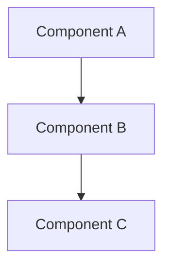

# Design Document

## Metadata

- **Spec**: `<NNN-spec-name>`
- **Status**: `draft | reviewed | approved`
- **Requirements source**: `requirements.md`

## Overview

[High-level description of the feature and its place in the overall system]

## Steering Document Alignment

### Technical Standards

[How the design follows documented technical patterns and standards from the project's architecture docs]

### Project Structure

[How the implementation will follow project organization conventions from the project's structure docs]

## Code Reuse Analysis

[Identify existing components, services, utilities, and patterns that should be reused or extended rather than rebuilt]

| Existing asset | Reuse strategy                                             |
| -------------- | ---------------------------------------------------------- |
| [file/symbol]  | [extend / wrap / call directly / use as pattern reference] |

## Selected Approach

- **Chosen option**: [Option name]
- **Why this option**: [Why it is the minimal safe fit]
- **Rejected alternatives**: [Short reason for each]

## Architecture

[Describe the overall architecture and design patterns used]



## Components and Interfaces

## Files and Modules Affected

- **Create**: `[path/to/new/file]`
- **Modify**: `[path/to/existing/file]`
- **No change**: `[important area intentionally left untouched]`

### Component 1

- **Purpose:** [What this component does]
- **Interfaces:** [Public methods/APIs]
- **Dependencies:** [What it depends on]

### Component 2

- **Purpose:** [What this component does]
- **Interfaces:** [Public methods/APIs]
- **Dependencies:** [What it depends on]

## Data Models

### Model 1

```
- id: [unique identifier type]
- name: [string/text type]
- [additional properties as needed]
```

### Model 2

```
- id: [unique identifier type]
- [additional properties as needed]
```

## Error Handling

## Compatibility and Rollout

- **Backward compatibility**: [What stays compatible / what changes]
- **Migration or sequencing**: [Any ordering requirements]
- **Feature flag / rollout plan**: [If applicable]
- **Rollback plan**: [If the implementation needs to be reversed]

### Error Scenarios

1. **Scenario 1:** [Description]
   - **Handling:** [How to handle]
   - **User Impact:** [What user sees]

2. **Scenario 2:** [Description]
   - **Handling:** [How to handle]
   - **User Impact:** [What user sees]

## Testing Strategy

### Unit Testing

- [Unit testing approach]
- [Key components to test]

### Integration Testing

- [Integration testing approach]
- [Key flows to test]

### End-to-End Testing

- [E2E testing approach, if applicable]
- [User scenarios to test]

## Observability

- [Logs, metrics, tracing, dashboards, alerts, or audit hooks needed]

## Risks and Trade-offs

| Risk     | Likelihood     | Impact         | Mitigation            |
| -------- | -------------- | -------------- | --------------------- |
| [Risk 1] | [Low/Med/High] | [Low/Med/High] | [Mitigation strategy] |

## Open Questions and Unverified Assumptions

- **Unverified**: [Anything that still needs repo or runtime confirmation]
- **Open question**: [Any decision still awaiting approval]

## Steering Updates Required

- [ ] No steering doc updates expected
- [ ] Update `steering/product.md`
- [ ] Update `steering/tech.md`
- [ ] Update `steering/structure.md`
- Notes: [What changed and why]
